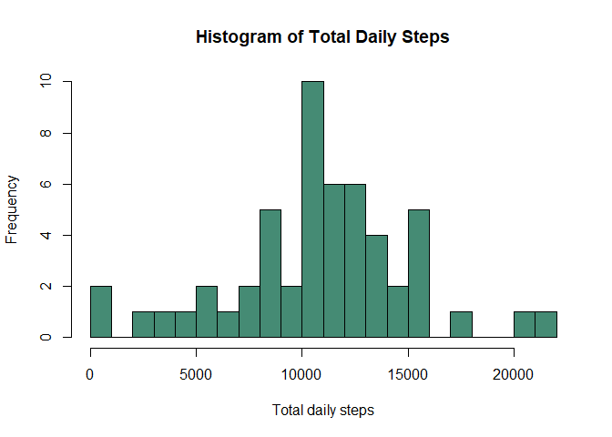
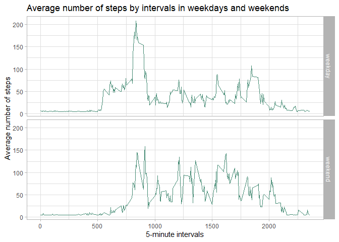

Reproducible Research: Peer Assessment 1
================

This is a report that analyses data from a personal monitoring device of
an anonymous individual to better understand daily activity patterns.

### Loading and pre-processing data

We first read the data:

``` r
dat<-read.csv(unz("activity.zip", "activity.csv"), header=T)
```

And make the following pre-processing tasks: 1) Set date variable as
class date

``` r
dat$date<-as.Date(dat$date)
```

### Mean number of steps per day

The histogram shows that the most frequent total number of daily steps
ranged between 10 and 11 thousand. We can observe outliers above 15000
and below 10000, and a relatively uniform distribution between those
values.

``` r
#Calculate total daily steps
totaldailysteps<-tapply(dat$steps, dat$date, FUN=sum)

#Plot
hist(totaldailysteps, breaks=30, main="Histogram of Total Daily Steps", xlab="Total daily steps", col="aquamarine4")
```

<!-- -->

``` r
#Calculate mean and median daily steps
options(scipen=999) #option to not show scientific notation
options(digits=0) #option for 0 decimal places
meansteps<-mean(tapply(dat$steps, dat$date, FUN=sum), na.rm=TRUE)
mediansteps<-median(tapply(dat$steps, dat$date, FUN=sum), na.rm=TRUE)
```

The mean number of steps taken per day is 10766. And the median number
of steps taken per day is 10765.

### Average daily activity pattern

The number of steps taken by 5-min intervals throughout the days ranged
from 0 to a little over 200. Most steps were taken between the intervals
500th and 2000th, with little activity before and after that.

``` r
#Calculate average steps per daily interval
averageintervalsteps<-tapply(dat$steps, dat$interval, FUN=mean, na.rm=TRUE)
dailyintervals<-(dat$interval[1:288])
dfbyintervals<-cbind( dailyintervals, averageintervalsteps)

#Plot
plot(dfbyintervals, type="l", main= "Average number of steps taken by 5-min daily intervals", col="aquamarine4", xlab="Daily 5-min intervals", ylab="Average number of steps")
```

<!-- -->

``` r
#Interval with maximum number of steps on average
maxsteps<-max(averageintervalsteps)
meansteps<-mean(averageintervalsteps)
intervalwithmaxsteps<-dailyintervals[which.max(averageintervalsteps)]
```

The 5-minute interval that, on average, contains the maximum number of
steps is 835th, with 206 steps. This is considerably larger than the 37
average number of steps taken throughout the day in 5-minute intervals.

### Imputing missing values

The presence of missing data for some days may introduce bias into some
calculations or summaries of the data. We will impute missing values to
assess the potential effect of missing bias.

``` r
narows<-sum(is.na(dat))
percentage<-(narows/17568)*100
```

The total number of observations in this dataset is 17568, with 2304 of
those rows having missing values (NAs). There is 13% missingness. We
will use the average number of steps to fill in the value when this
information is missing for a specific interval.

``` r
#Mean imputation
completedat<-dat
completedat$steps[is.na(completedat$steps)]<-  mean(completedat$steps, na.rm=TRUE)
#Recalculate the total daily steps with imputed data
totaldailystepsimputed<-tapply(completedat$steps, completedat$date, FUN=sum)
```

The histogram for the total daily steps with the imputed dataset is very
similar to the original plot with missing data. The most frequent number
of steps taken daily remains to be between 10000 and 110000.

``` r
#Plot
hist(totaldailystepsimputed, breaks=30, main="Histogram of Total Daily Steps (Imputed)", xlab="Total daily steps", col="aquamarine4")
```

<!-- -->

``` r
#Calculate mean and median daily steps (imputed)
options(scipen=999) #option to not show scientific notation
options(digits=0) #option for 0 decimal places
meanstepsimputed<-mean(tapply(completedat$steps, completedat$date, FUN=sum), na.rm=TRUE)
medianstepsimputed<-median(tapply(completedat$steps, completedat$date, FUN=sum), na.rm=TRUE)

#Compare the effect of imputing missing data on the total number of steps taken
sumtotaldailysteps<-sum(totaldailysteps, na.rm=TRUE)
sumtotaldailystepsimputed<-sum(totaldailystepsimputed, na.rm=TRUE)
```

The mean number of steps (imputed) taken per day is 10766, which is
exactly the same as the estimate result obtained with the missing values
dataset. The median number of steps (imputed) taken per day is 10766,
which is very close to the value obtained with the missing values
dataset. The estimate of total number of daily steps with the missing
values dataset was 570608, once imputed, the total number of daily steps
is 656738 instead. Imputing missing data has an effect on the total
number of daily steps taken, but almost none in its statistical summary
values (the median and mean).

### Differences in activity patterns between weekdays and weekends

Weekend activity starts a bit later (at around the 750th interval)
compared to weekdays (around the 500th interval). During weekends, steps
are more uniformly distributed throughout the day. During the weekdays,
activity mostly concentrates around the 800th interval peak, and it is
lower later on.

``` r
#Create factor variable to indicate weekends
completedat$weekday<-factor(weekdays(completedat$date))
levels(completedat$weekday)<-list(weekday=c("lunes", "martes", "miércoles", "jueves", "viernes"),
                                     weekend= c("sábado", "domingo"))

#Calculate average steps per weekday and interval
averageweekdayintervalsteps<-completedat %>% 
  group_by(interval, weekday) %>%
  summarise(intervalweekdaysteps=mean(steps))
```

    ## `summarise()` regrouping output by 'interval' (override with `.groups` argument)

``` r
#Plot
ggplot(averageweekdayintervalsteps, aes(interval, intervalweekdaysteps)) +
  geom_line(col="aquamarine4")+
  facet_grid(weekday~.)+
  labs(title="Average number of steps by intervals in weekdays and weekends", x="5-minute intervals", y="Average number of steps")+
  theme_light()
```

<!-- -->
